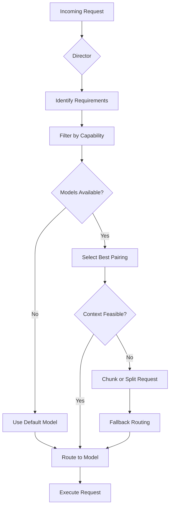

When a multi-agent system receives a request, the routing decision determines which AI model handles it. This seemingly simple choice impacts cost, latency, and output quality. Understanding per-persona model routing helps you build efficient, reliable AI tooling in Go.

## Why Model Routing Matters

In a multi-agent orchestration system, different AI tasks demand different capabilities. You route math-heavy requests to specialized models, conversation-heavy tasks to cost-effective models, and synthesis-heavy work to models with large context windows.

Without proper routing, you waste budget on expensive models for trivial tasks or miss opportunities to solve complex problems affordably. The routing layer acts as the gatekeeper that matches request requirements to model capabilities.

## Catalog Discovery

Before routing can happen, your system discovers and registers available models. Think of this as a model registry that stores routing metadata.

```go
package modelregistry

type ModelInfo struct {
    Name        string
    Organization string
    Capabilities model.CapabilitySet
    MaxTokens   int
    DefaultPersona model.Persona
}

type Catalog struct {
    Models       []ModelInfo
    LastUpdated  time.Time
    Version      string
}

var catalog = NewCatalog()

func NewCatalog() Catalog {
    return Catalog{
        Models: []ModelInfo{
            {
                Name:            "meta-llama-3-70b",
                Organization:    "meta",
                MaxTokens:       8000,
                Capabilities:    model.Capabilities{Synthesis: true, CodeGen: true, Reasoning: true},
                DefaultPersona: model.Persona{
                    Name: "analyst",
                    Role: "Deep reasoning and complex analysis",
                },
            },
        },
    }
}
```

The catalog stores each model's identity, capabilities, and the persona it naturally serves. When your Director component queries the catalog, it discovers what models are available for routing decisions.

```go
package director

type Director struct {
    catalog   modelregistry.Catalog
    personas  map[string][]string // persona name -> compatible model names
}

func NewDirector(catalog modelregistry.Catalog) Director {
    return Director{
        catalog:   catalog,
        personas:  modelregistry.BuildPersonaMap(catalog),
    }
}
```

The `BuildPersonaMap` function constructs the mapping that enables quick persona-to-model lookups. This is the foundation for all routing decisions.

## Director Routing Decision

The Director component evaluates incoming requests and selects the appropriate model-persona combination. It examines request context, desired output type, and available resources.

```go
package director

func (d *Director) RouteRequest(request Request) (model.Model, error) {
    // 1. Identify request requirements from context
    requirements := d.identifyRequirements(request)
    
    // 2. Filter models by capability match
    candidateModels := d.filterByCapability(requirements)
    
    // 3. Select best persona-model pairing
    selected := d.selectBestPairing(candidateModels, request.Context)
    
    // 4. Verify context window feasibility
    if !d.checkContextFeasibility(selected, request) {
        return d.fallbackToStandardModel(request)
    }
    
    return selected.Model, nil
}
```

The routing logic follows a four-step process:

1. **Identify Requirements**: Extract task type, complexity hints, and expected output from the request
2. **Filter by Capability**: Match requirement types to model capabilities
3. **Select Best Pairing**: Choose the persona-model combination that best fits the task
4. **Verify Feasibility**: Ensure the context window can accommodate the expected synthesis

This pipeline guarantees that every routed request has a suitable model with adequate capacity.

### Routing Decision Diagram



The diagram shows how the Director orchestrates routing. When context windows prove insufficient, the system either splits the request or falls back to a more robust model.

## Per-Persona Model Assignments

You configure per-persona model assignments through a declarative manifest. Each persona declares its role and preferred models.

```go
package config

type PersonaConfig struct {
    Name        string
    Description string
    Models      []string `json:"preferredModels,omitempty"`
    Fallback    string   `json:"fallbackModel,omitempty"`
    ContextMode ContextMode
}

type ContextMode struct {
    Compressed bool
    Expand     bool
}

var personaConfigs = map[string]*PersonaConfig{
    "coder": {
        Name: "coder",
        Description: "Code generation and refactoring specialist",
        Models: []string{"meta-llama-3-8b", "anthropic/claude-3-haiku"},
        Fallback: "anthropic/claude-3-haiku",
        ContextMode: ContextMode{
            Compressed: true,
        },
    },
    "synthesizer": {
        Name: "synthesizer",
        Description: "Handles multi-document synthesis tasks",
        Models: []string{"meta-llama-3-70b", "anthropic/claude-3-opus"},
        Fallback: "meta-llama-3-70b",
        ContextMode: ContextMode{
            Expand: true,
        },
    },
    "simple": {
        Name: "simple",
        Description: "Fast, cost-effective for simple queries",
        Models: []string{"anthropic/claude-3-haiku", "google/gemini-flash"},
        Fallback: "anthropic/claude-3-haiku",
        ContextMode: ContextMode{
            Compressed: false,
            Expand:     false,
        },
    },
}
```

The `PersonaConfig` structure encodes routing preferences:

- **preferredModels**: Ordered list of models to try for this persona
- **fallbackModel**: Model to use when primary options fail
- **ContextMode**: Settings for handling context window constraints

This configuration enables your Director to make informed routing decisions without hard-coding model assignments.

## Context-Window Considerations for Synthesis-Heavy Tasks

Synthesis-heavy tasks like multi-document summarization or cross-referencing often push context windows to their limits. You must handle this scenario proactively.

```go
package director

func (d *Director) checkContextFeasibility(selected model.Model, request Request) bool {
    estimatedInput := d.estimateContextUsage(request)
    
    if selected.MaxTokens < estimatedInput {
        d.logger.Warnw("insufficient context", "model", selected.Name,
            "estimated", estimatedInput, "max", selected.MaxTokens)
        
        if selected.ContextMode.Compressed {
            return true // Compression may recover space
        }
        
        if selected.ContextMode.Expand {
            // Try expanding context window if allowed
            return d.attemptContextExpansion(request)
        }
        
        return false // Context insufficient
    }
    
    return true
}
```

The context check follows these principles:

1. **Estimate Input Size**: Calculate expected tokens based on request payload
2. **Compare to Max Tokens**: Verify available context capacity
3. **Attempt Recovery**: Try compression or expansion strategies
4. **Fallback if Needed**: Route to a model with adequate capacity

For synthesis tasks specifically, you might implement chunk-based processing:

```go
package director

func (d *Director) attemptContextExpansion(request Request) bool {
    // Split large requests into smaller chunks
    chunks := d.chunkRequest(request)
    
    // Process each chunk with the same model
    for _, chunk := range chunks {
        result := d.RouteRequest(chunk)
        // Accumulate results or pass to a synthesizer model
    }
    
    return true
}
```

This pattern enables handling arbitrarily large synthesis tasks by breaking them into manageable pieces.

## Putting It All Together

Here's a complete routing component that demonstrates catalog discovery, persona assignment, and context handling:

```go
package routing

import (
    "context"
    "time"
)

type Router struct {
    catalog      modelregistry.Catalog
    personaConfig map[string]*PersonaConfig
    models       map[string]model.Model
}

func NewRouter(catalog modelregistry.Catalog, config map[string]*PersonaConfig) *Router {
    models := make(map[string]model.Model)
    
    // Load models from catalog
    for _, m := range catalog.Models {
        model, err := model.NewModel(m.Name, context.Background())
        if err != nil {
            continue
        }
        models[m.Name] = model
    }
    
    return &Router{
        catalog:      catalog,
        personaConfig: config,
        models:       models,
    }
}

func (r *Router) HandleRequest(ctx context.Context, request Request) (*model.Response, error) {
    startTime := time.Now()
    
    // Step 1: Discover available models via catalog
    if err := r.catalog.Refresh(context.Background()); err != nil {
        return nil, fmt.Errorf("failed to refresh model catalog: %w", err)
    }
    
    // Step 2: Route to appropriate persona-model pair
    selectedModel, err := r.catalog.Directorate.RouteRequest(request)
    if err != nil {
        return nil, fmt.Errorf("routing failed: %w", err)
    }
    
    // Step 3: Execute with context-aware timeout
    timeoutCtx, cancel := context.WithTimeout(ctx, 60*time.Second)
    defer cancel()
    
    response, err := selectedModel.Generate(timeoutCtx, request.Prompt)
    if err != nil {
        return nil, fmt.Errorf("generation failed: %w", err)
    }
    
    metrics.ObserveGeneration(response.ModelName, time.Since(startTime))
    
    return response, nil
}
```

This example shows the complete flow from catalog discovery to model execution. The router refreshes the catalog, routes to the best match, and handles timeouts appropriately.

## Conclusion

Per-persona model routing enables multi-agent systems to leverage different AI models for different tasks efficiently. The key components are:

- **Catalog discovery** registers models and their capabilities
- **Director routing** evaluates requests and selects appropriate pairings
- **Persona assignments** configure model preferences per role
- **Context handling** manages synthesis-heavy workloads

By implementing this routing pattern, you build systems that adapt to task requirements while optimizing for cost and performance.

Start by defining your persona configurations, then wire up a catalog that discovers available models. The Director component orchestrates routing based on request context. For production systems, add observability to monitor routing decisions and model performance.

To dive deeper into multi-agent routing patterns, explore the go-orca documentation or contribute to the open-source implementation.