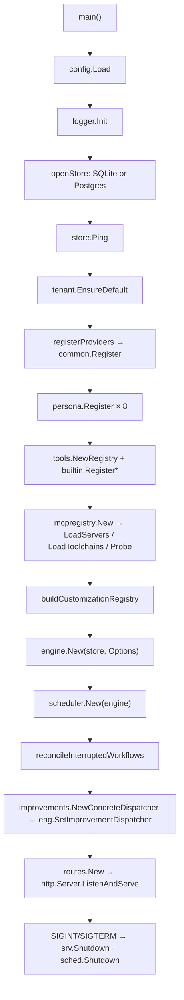
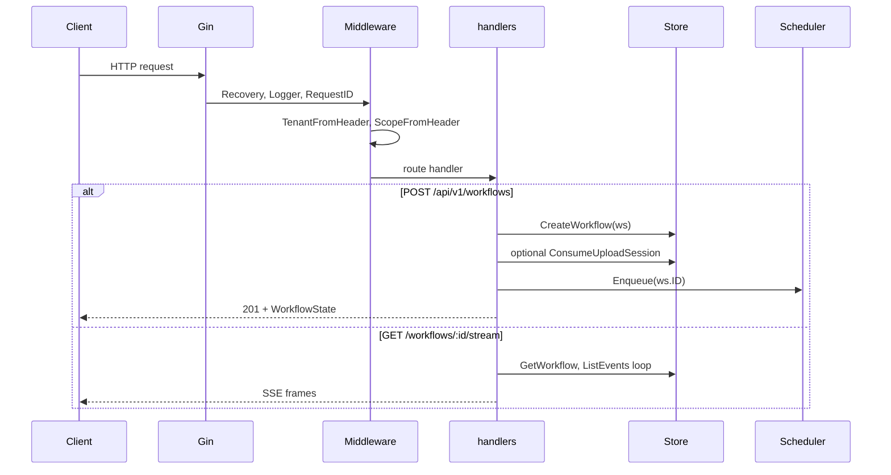
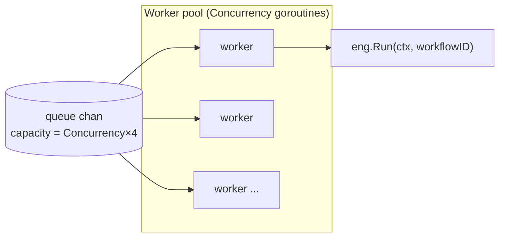
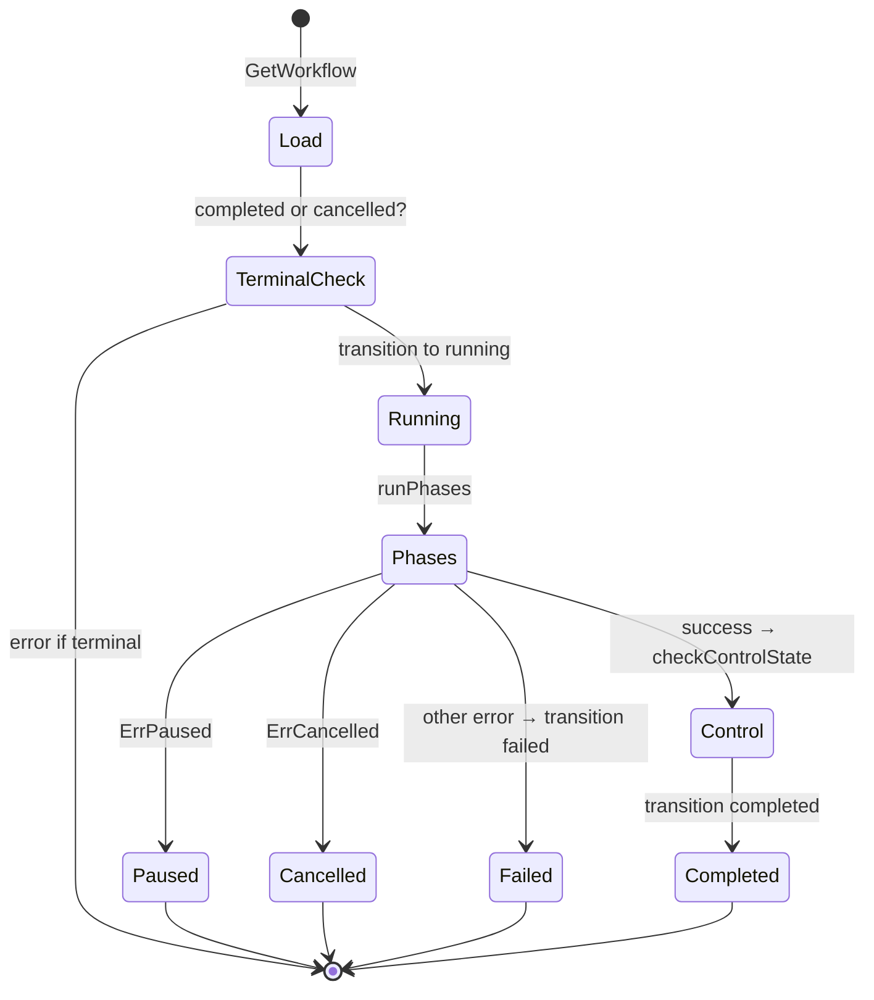
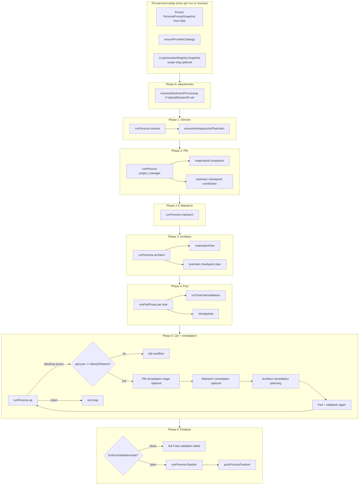
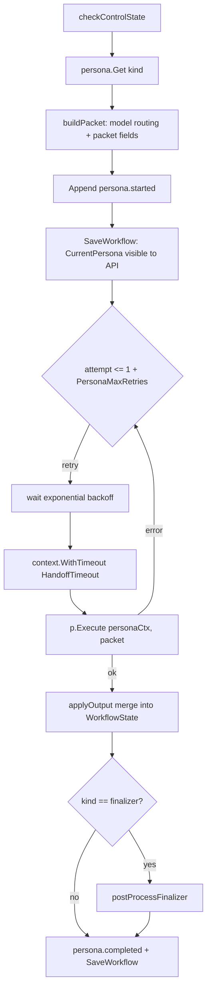
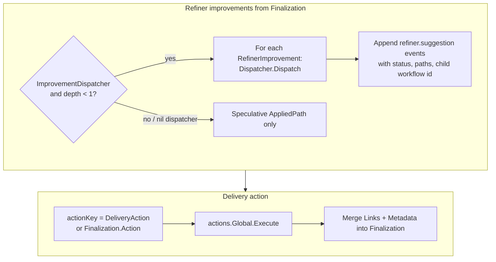
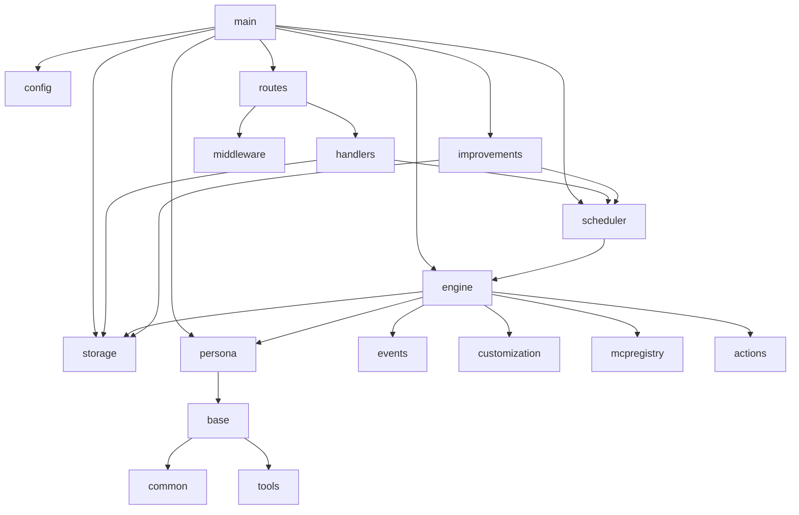

# go-orca codebase tour

This document is a **step-by-step walkthrough** of how the repository is organized, where execution starts, and how control flows from HTTP (or recovery) through the scheduler into the workflow engine. It is meant to complement [architecture.md](./architecture.md) and [workflow-engine.md](./workflow-engine.md) with **call-level detail** and **diagrams** you can keep for reference.

> **Naming note:** User-facing docs and the README sometimes say “Implementer.” In code, the execution persona is **`pod`** (`state.PersonaKind = "pod"`). The implementation lives in `internal/persona/implementer` (type `Pod`). Tasks are assigned to `assigned_to: "pod"`.

---

## 1. What ships in this repo

| Area | Path | Role |
|------|------|------|
| **Primary server** | `cmd/go-orca-api` | HTTP API, workflow scheduler, engine wiring |
| **MCP helper binaries** | `cmd/mcp-*` | Standalone MCP servers (filesystem, git, language toolchains, workspace) invoked by the MCP registry, not the main request path |
| **Core orchestration** | `internal/workflow/engine` | State machine: phases, QA loop, toolchain hooks, finalizer post-processing |
| **Concurrency** | `internal/workflow/scheduler` | Bounded queue + worker pool calling `Engine.Run` |
| **HTTP surface** | `internal/api/routes`, `internal/api/handlers`, `internal/api/middleware` | Gin router, handlers, tenant/scope middleware |
| **LLM adapters** | `internal/provider/*` | OpenAI, Anthropic, Ollama, Copilot — registered in `internal/provider/common` |
| **Personas** | `internal/persona/*` | Each role: `Execute(ctx, HandoffPacket) → PersonaOutput` |
| **Shared LLM runner** | `internal/persona/base` | Tool loop + structured JSON phase (`Executor.Run`) |
| **Persistence** | `internal/storage`, `internal/storage/sqlite`, `internal/storage/postgres` | `Store` interface |
| **Multi-tenancy** | `internal/tenant`, `internal/scope` | Default tenant/scope; scope hierarchy CRUD |
| **Customization** | `internal/customization` | Filesystem sources → per-scope snapshot (skills, agents, prompts) |
| **Self-improvement** | `internal/improvements` | Dispatches refiner proposals to files or child workflows |
| **Delivery** | `internal/finalizer/actions` | GitHub PR, webhook, bundles, etc. |
| **Config** | `internal/config`, `go-orca.yaml` | Viper + `GOORCA_*` env overrides |

---

## 2. Entry point: `cmd/go-orca-api/main.go`

Every API-driven workflow begins when this process starts. There is **no other Go entry point** for the orchestration server; MCP commands are separate processes.

### Decisions encoded in `main`

1. **Storage driver** — `openStore` switches on `cfg.Database.Driver` (Postgres vs SQLite), optional auto-migrate.
2. **Default tenant/scope** — `tenant.EnsureDefault` guarantees a row the API can default headers to.
3. **Providers** — Each enabled provider is constructed and `common.Register`’d; failures are **warnings**, not fatal.
4. **Default provider/model for the engine** — `resolveDefaultProvider` / `resolveDefaultModel` prefer Ollama, then Anthropic, OpenAI, Copilot (see `main.go`).
5. **Improvements filesystem** — `customReg.AddSource` for `artifacts/.../improvements/active` so promoted improvements are customization inputs.
6. **Dispatcher wiring** — `Engine` is created **before** the scheduler so `SetImprovementDispatcher` can run after `NewConcreteDispatcher(store, sched)` exists (avoids import cycles while satisfying `engine.ImprovementDispatcher`).

---

## 3. HTTP request path

Router wiring lives in `internal/api/routes/routes.go`. Important behaviors:

- **Tenant ownership** — `checkWorkflowOwnership` in `handlers.go` ensures `GET`/`POST` on a workflow ID matches `X-Tenant-ID` when set; scope is not used to deny access to own tenant’s workflows.
- **Create workflow** — `CreateWorkflow` requires **both** `X-Tenant-ID` and `X-Scope-ID` (no silent empty here, unlike middleware defaults for other routes — see `handlers.go`).
- **Enqueue failures** — If the scheduler queue is full, creation still returns **201**; the workflow stays `pending` until resume or a later enqueue.

---

## 4. Scheduler: from queue to `Engine.Run`

File: `internal/workflow/scheduler/scheduler.go`.

`Enqueue` is non-blocking on the **send** only until the buffer fills; then it returns an error.

`runJob` interprets engine errors:

| Error | Scheduler behavior |
|--------|---------------------|
| `nil` | Log completion |
| `engine.ErrPaused` | Info log; no retry |
| `engine.ErrCancelled` | Info log; no retry |
| Other | Error log; optional retry after `RetryDelay` if `MaxRetries` allows |

---

## 5. Engine: `Run` then `runPhases`

File: `internal/workflow/engine/engine.go`.

### 5.1 `Run` (high level)

- **Cancellation mid-flight** — `checkControlState` re-reads the workflow from the store; if status became `cancelled`, the engine resets in-flight task markers and returns `ErrCancelled`. This lets the API cancel without killing the whole process context.

### 5.2 `runPhases` (ordered pipeline)

The following matches the **current** code order (Director → PM → optional Matriarch → Architect → Pod → QA loop → Finalizer). The Director may set `ws.RequiredPersonas` to skip phases (e.g. content workflows that omit the pod).

#### Resume / skip logic

- **`phaseComplete(kind)`** — If `ws.Summaries[kind]` is non-empty, that persona is skipped on resume (successful completion recorded).
- **`personaRequired(kind)`** — If `ws.RequiredPersonas` is empty, all personas are required except the Director gate; after the Director runs, only listed kinds run.

#### Scope slug for customizations

`engine.Options.ScopeResolver` is optional. **`main.go` does not currently set `ScopeResolver`**, so `Snapshot("")` is used and **all customization sources match every workflow** unless you extend `main` to pass a resolver (see `docs/customization.md`).

---

## 6. Single persona invocation: `runPersona`

**Model routing** (summary; detail in `workflow-engine.md` and `model_routing.go`):

1. Snapshot catalogs per provider at workflow start.
2. Director output is normalized to allowed models.
3. `buildPacket` picks per-persona model from `ws.PersonaModels[kind]` → `ws.ModelName` → catalog default.

**`Executor.Run`** (`internal/persona/base/executor.go`):

- Resolves provider from `packet.ProviderName`.
- **Phase A** — If tools exist and the provider supports tool calling: chat loop executing `ToolRegistry.Call` (up to 25 rounds).
- **Phase B** — System prompt stripped of tool instructions; model must return **raw JSON** matching the persona schema.

---

## 7. Pod phase (`runPodPhase`)

Tasks come from the Architect. The engine only runs tasks where `assigned_to == "pod"` and status is `pending` or `ready`. Each task gets a **narrow** `HandoffPacket` (single task in the slice) so the model focuses on one unit of work.

Toolchain integration (software-ish modes) can append **engine-level** blocking issues after implementation; those feed the same QA/remediation story as LLM-reported blockers.

---

## 8. Finalizer aftermath: refiner proposals and delivery

`postProcessFinalizer` does two major things **in order**:

- **`DeliveryAction`** from the API overrides the LLM-chosen `Finalization.Action` (enforced in code).
- **Recursion guard** — `ws.Execution.ImprovementDepth >= 1` skips dispatcher to avoid improvement workflows spawning infinite improvement workflows.

---

## 9. Process startup recovery

`reconcileInterruptedWorkflows` (`cmd/go-orca-api/recovery.go`) runs at boot: any workflow still marked `running` in the DB (crash mid-flight) is transitioned to **failed** with a specific error message so operators can **resume** intentionally.

---

## 10. MCP `cmd/mcp-*` binaries (secondary entry points)

These are **not** part of the Gin request lifecycle. They are MCP servers (stdio or configured transport) that `internal/mcp/registry` starts or connects to so **tool definitions** resolve to real tools during persona execution.

Typical relationship:

```mermaid
flowchart LR
  API[go-orca-api] --> REG[MCP Registry]
  REG -->|spawn or connect| MCP1[mcp-filesystem]
  REG --> MCP2[mcp-go-toolchain]
  REG --> MCPn[...]
  REG --> TR[ToolRegistry merged specs]
  TR --> EXE[Executor Phase A tool calls]
```

---

## 11. Package dependency mental model

---

## 12. Suggested reading order for new contributors

1. `cmd/go-orca-api/main.go` — bootstrap order.
2. `internal/api/routes/routes.go` — what exists on the wire.
3. `internal/workflow/scheduler/scheduler.go` — concurrency contract.
4. `internal/workflow/engine/engine.go` — `Run`, `runPhases`, `runPersona`, `postProcessFinalizer`.
5. `internal/state/state.go` — `WorkflowState`, `HandoffPacket`, `Task`, enums.
6. `internal/persona/base/executor.go` — how every persona talks to providers.
7. `internal/storage/store.go` — persistence contract.

---

## 13. Diagram source

All diagrams in this file use [Mermaid](https://mermaid.js.org/). They render on GitHub and in many Markdown preview tools. To export static images for slides, use the Mermaid CLI or your editor’s export feature.
