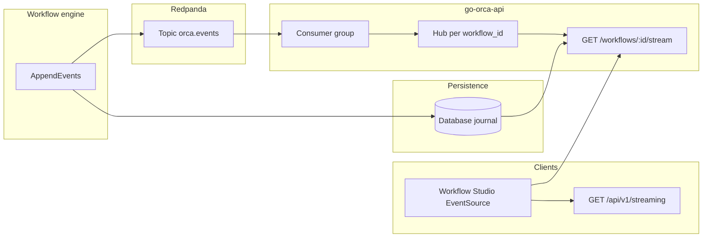
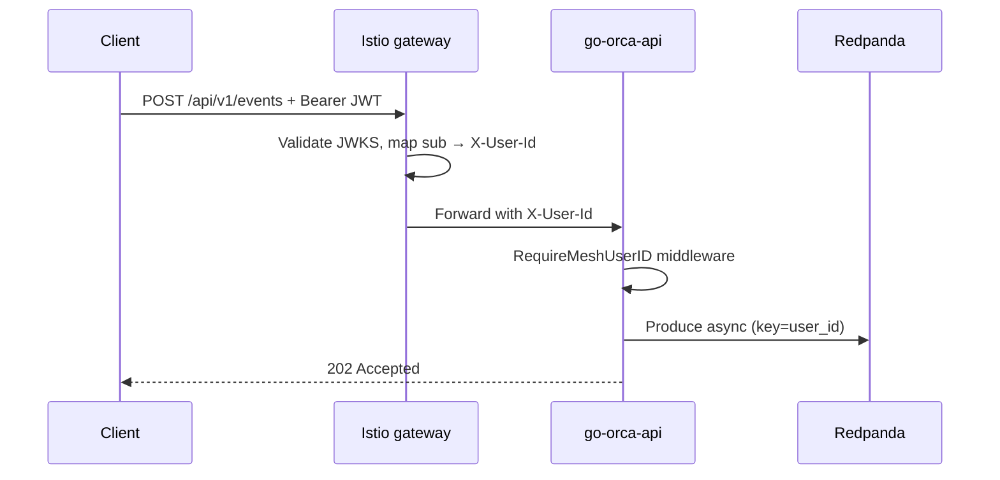

# Event Streaming (Redpanda)

go-orca can publish workflow journal events to **Redpanda** (Kafka-compatible) and deliver live updates to clients over **Server-Sent Events (SSE)** without polling the database on every tick. The same topic also accepts **edge-authenticated** ingest from external clients (JWT at the mesh gateway).

Streaming is **optional**. With `streaming.enabled: false` (the default), workflow SSE uses database polling only — behaviour unchanged from earlier releases.

---

## Two paths on one topic

Both paths use the configured topic (default `orca.events`) but different message shapes and partition keys:

| Path | HTTP entry | Partition key | Payload |
|------|------------|---------------|---------|
| **Workflow journal** | Internal — engine `AppendEvents` | `workflow_id` | JSON envelope `{"kind":"workflow.event","event":{...}}` |
| **Edge ingest** | `POST /api/v1/events` (e.g. `events.example.com`) | `user_id` from `X-User-Id` | Opaque client JSON (not wrapped) |

The **Workflow Studio UI** and `GET /workflows/:id/stream` use only the workflow journal path. Edge ingest is for authenticated clients outside the UI tenancy headers.

---

## Workflow journal: end-to-end

When streaming is enabled, `main` wires a producer, consumer, and in-process hub. The store wrapper mirrors every journal append to Redpanda after the database write succeeds.



### ASCII overview (same flow)

```
  Engine.AppendEvents
        │
        ├──────────────────► DB (source of truth)
        │
        └──────────────────► Redpanda  key=workflow_id
                                    │
                                    ▼
                             Consumer (consumer_group)
                                    │
                                    ▼
                             Hub.Subscribe(workflow_id)
                                    │
                                    ▼
  Client ◄── SSE ─── GET /workflows/:id/stream
              │
              └── initial snapshot: ListEvents from DB
                  live frames: hub (X-Stream-Transport: redpanda)
```

### SSE handler behaviour

`StreamWorkflowEvents` chooses transport from `?source=`:

| `source` | Behaviour |
|----------|-----------|
| `auto` (default) | Redpanda hub when configured; otherwise database poll |
| `redpanda` | DB snapshot on connect, then hub (503-style fallback if hub missing) |
| `database` | Poll journal every 1s (`X-Stream-Transport: database`) |

Terminal workflows (`completed`, `failed`, `cancelled`) return a one-shot SSE snapshot and close without subscribing.

Response header **`X-Stream-Transport`** is set to `redpanda` or `database` so proxies and the UI can show which path is active.

---

## Edge ingest: JWT to Redpanda

External clients post raw event bodies to the API. Identity comes from the service mesh (Istio JWT validation → `X-User-Id`), not from `X-Tenant-ID` / `X-Scope-ID`.



- **202 Accepted** — record accepted into the producer buffer (async `Produce`; not yet broker-acked).
- **400** — missing user header or empty body.
- **503** — producer unavailable or enqueue failed.

Prometheus metrics on `/metrics` track ingest volume and latency when streaming is enabled.

---

## On-wire message format (workflow journal)

Workflow records use a small envelope so the consumer can ignore non-journal traffic on a shared topic:

```json
{
  "kind": "workflow.event",
  "event": {
    "id": "uuid",
    "workflow_id": "uuid",
    "type": "persona.started",
    "persona": "director",
    "payload": {},
    "occurred_at": "2024-01-01T00:00:00Z"
  }
}
```

Implementation: `internal/streaming/message.go` (`KindWorkflowEvent`, `MarshalWorkflowEvent`, `ParseWorkflowEvent`).

---

## HTTP API

| Method | Path | Purpose |
|--------|------|---------|
| `GET` | `/api/v1/streaming` | Capabilities for UI: `{ "enabled", "workflow_stream", "workflow_topic?" }` |
| `GET` | `/api/v1/workflows/{id}/stream` | SSE; query `timeout`, `source` |
| `POST` | `/api/v1/events` | Edge ingest (requires mesh user header; streaming enabled) |
| `GET` | `/metrics` | Prometheus (when streaming metrics registered) |

See [API Reference](api.md) for request/response detail and [OpenAPI](openapi.yaml) for machine-readable schemas.

### Workflow Studio (Next.js BFF)

The UI proxies through `/api/orca/*`:

- `getStreamingCapabilities()` → `GET /api/orca/streaming`
- `buildWorkflowStreamUrl(id, context, timeout, source)` → EventSource URL with `?source=auto|redpanda|database`

The Events tab exposes a **Transport** selector when Redpanda is enabled server-side.

---

## Configuration

All keys live under `streaming` in `go-orca.yaml`. Override with `GOORCA_STREAMING_*` (see [Configuration](configuration.md#streaming)).

| Key | Default | Description |
|-----|---------|-------------|
| `enabled` | `false` | Master switch |
| `brokers` | `["redpanda.redpanda.svc.cluster.local:9092"]` | Seed brokers |
| `topic` | `orca.events` | Topic for journal + edge ingest |
| `client_id` | `go-orca-api` | Kafka client id |
| `produce_timeout` | `5s` | Per-record delivery timeout |
| `required_acks` | `all` | `all` \| `leader` \| `none` |
| `user_id_header` | `X-User-Id` | Header for edge ingest identity |
| `readiness_probe_interval` | `10s` | Background broker ping interval |
| `readiness_ping_timeout` | `2s` | Single ping timeout |
| `consumer_group` | `go-orca-workflow-stream` | Consumer group for hub fan-out |

When `enabled` is true, startup validates non-empty `brokers`, `topic`, and `user_id_header`. `/readyz` includes cached broker health from the background ping (not a synchronous ping per probe).

Example:

```yaml
streaming:
  enabled: true
  brokers:
    - "redpanda.redpanda.svc.cluster.local:9093"
  topic: "orca.events"
  consumer_group: "go-orca-workflow-stream"
```

---

## Package map

| Package / type | Role |
|----------------|------|
| `internal/streaming/producer.go` | franz-go async producer; `Produce` (edge), `PublishWorkflowEvent` (journal) |
| `internal/streaming/consumer.go` | Consumer group → parse envelope → `Hub.Publish` |
| `internal/streaming/hub.go` | In-memory fan-out per `workflow_id` |
| `internal/streaming/readiness.go` | Cached broker health for `/readyz` |
| `internal/streaming/metrics.go` | Prometheus counters/histograms |
| `internal/storage/streaming_store.go` | Wraps `Store.AppendEvents` to mirror DB writes |
| `internal/api/handlers/stream_workflow.go` | SSE: Redpanda vs database |
| `internal/api/handlers/streaming.go` | `GET /streaming` capabilities |
| `internal/api/handlers/events.go` | `POST /events` ingest |
| `internal/api/middleware` | `RequireMeshUserID` for ingest |

Shutdown (when enabled): cancel consumer context, flush producer, stop readiness loop.

---

## Deployment notes

- **Reverse proxy:** SSE still requires `proxy_buffering off` (or equivalent). See [Deployment](deployment.md#reverse-proxy-nginx).
- **Homelab:** Enable chart-level `streaming.enabled` and deploy an API image that includes this code; Redpanda topic bootstrap and Istio JWT routes live in the homelab repo (`namespace-go-orca`, `namespace-redpanda`).
- **Topic sizing:** Production homelab scaffolding uses six partitions on `orca.events` so multiple API replicas can share the consumer group.

---

## Related documents

- [Architecture](architecture.md) — system overview and event journal
- [API Reference](api.md) — stream, capabilities, and ingest endpoints
- [Configuration](configuration.md) — `streaming` keys and env vars
- [Deployment](deployment.md) — proxy timeouts and graceful shutdown
