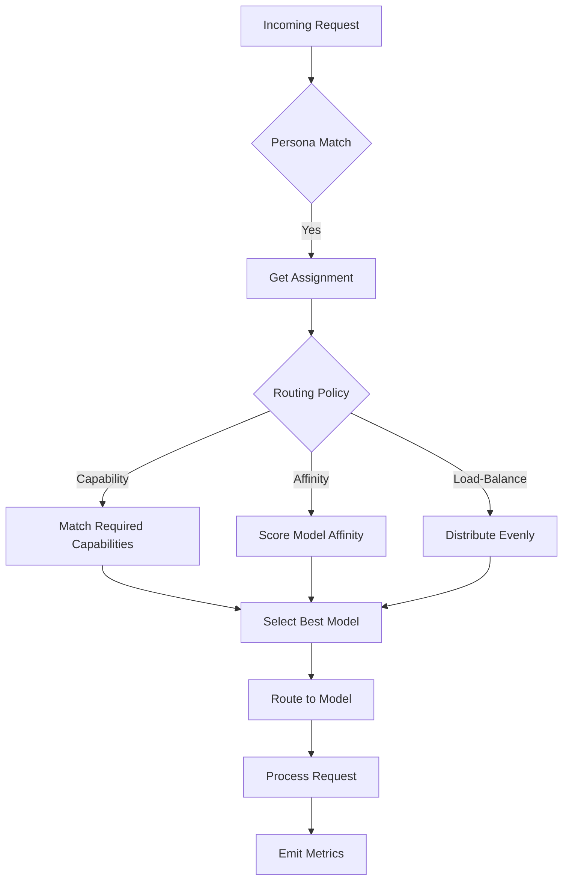

# Per-Persona Model Routing in Multi-Agent AI Orchestration Systems

## Why Model Routing Matters

Every API call costs money and latency. In multi-agent systems, naive routing that assigns every request to a single model regardless of capability, cost, or context constraints wastes budget and degrades user experience. Per-persona model routing addresses this by binding specific AI models to agent personas based on their workload patterns, capability requirements, and context-window budgets. The Director orchestrates these assignments dynamically, ensuring cost efficiency while maintaining response quality across diverse task types.

## Catalog Discovery

The Director begins routing decisions by discovering available models through multiple mechanisms. Static configuration provides an initial baseline:

```go
type ModelRegistry struct {
    Models map[string]*ModelDefinition
}

type ModelDefinition struct {
    ID              string
    Name            string
    ContextWindow   int
    MaxTokens       int
    Capabilities    []string
}

var registry = ModelRegistry{
    Models: map[string]*ModelDefinition{
        "text-davinci-002": {
            ID: "text-davinci-002",
            Name: "Standard Text Model",
            ContextWindow: 4096,
            Capabilities: []string{"summarization", "translation"},
        },
        "gpt-4": {
            ID: "gpt-4",
            Name: "Premium Model",
            ContextWindow: 8192,
            Capabilities: []string{"complex-reasoning", "code-generation", "math"},
        },
        "codex-small": {
            ID: "codex-small",
            Name: "Code Specialist",
            ContextWindow: 2048,
            Capabilities: []string{"code-generation", "code-completion"},
        },
    },
}
```

Hot-plug registration enables runtime model discovery through service discovery mechanisms like Consul or Kubernetes Service Mesh. The Director registers new models when they become available:

```go
func (r *ModelRegistry) RegisterModel(ctx context.Context, model *ModelDefinition) error {
    // Validate model before registration
    if model.ContextWindow == 0 {
        return errors.New("context window must be positive")
    }
    
    _, exists := r.Models[model.ID]
    if exists {
        return fmt.Errorf("model %q already registered", model.ID)
    }
    
    r.Models[model.ID] = model
    // Emit metrics and logs
    return nil
}
```

This design supports dynamic scaling where you spin up cheaper models for overflow workloads during traffic spikes while keeping premium models available for complex tasks.

## Director Routing Decision Logic

The Director implements routing strategies that balance load across models based on request characteristics. Three primary strategies guide routing decisions:

1. **Load-balancing**: Distribute requests evenly across models of equal capability
2. **Capability-based**: Route requests to models with required capabilities
3. **Affinity-based**: Route requests based on model-persona affinity scores

```go
type Director struct {
    registry  ModelRegistry
    assignments map[string]PersonaAssignment
}

type PersonaAssignment struct {
    PersonaID     string
    ModelIDs      []string
    RoutingPolicy RoutingPolicy
}

type RoutingPolicy int

const (
    PolicyRoundRobin RoutingPolicy = iota
    PolicyCapabilityMatch
    PolicyAffinityBased
)

func (d *Director) RouteRequest(ctx context.Context, request *Request, persona Persona) (*RouteDecision, error) {
    assignment, ok := d.assignments[persona.ID]
    if !ok {
        return nil, fmt.Errorf("no assignment for persona %q", persona.ID)
    }
    
    switch assignment.RoutingPolicy {
    case PolicyCapabilityMatch:
        // Find model with required capabilities
        return d.routeByCapabilities(ctx, request, assignment)
        
    case PolicyAffinityBased:
        // Select model based on affinity scores
        return d.routeByAffinity(ctx, assignment)
        
    default:
        // Round-robin as fallback
        return d.routeRoundRobin(ctx, assignment)
    }
}
```

The routing decision flow visualizes how requests traverse the orchestration pipeline:



## Per-Persona Model Assignments

Define personas and their model assignments through configuration files or runtime updates. The assignment structure specifies which models a persona can use:

```go
type PersonaConfig struct {
    ID          string          `json:"id"`
    Name        string          `json:"name"`
    Description string          `json:"description"`
    Personas    map[string]Role `json:"personas"`
}

type Role struct {
    ModelIDs    []string     `json:"model_ids"`
    Policy      RoutingPolicy `json:"policy"`
    Weight      float64      `json:"weight"`
}
```

A typical configuration might assign different models to different personas:

```yaml
personas:
  - id: "analyzer"
    name: "Code Analysis Agent"
    description: "Performs static analysis on codebases"
    personas:
      main:
        model_ids: ["codex-small", "gpt-4"]
        policy: affinity_based
        weight: 0.9
      overflow:
        model_ids: ["codex-small"]
        policy: round_robin
        weight: 0.3
```

Hot-reload patterns enable zero-downtime updates to assignments. The system monitors configuration file changes and applies updates atomically:

```go
func (d *Director) ReloadAssignments(ctx context.Context, path string) error {
    newConfig, err := loadConfig(path)
    if err != nil {
        return fmt.Errorf("failed to load new config: %w", err)
    }
    
    d.assignmentsMutex.Lock()
    defer d.assignmentsMutex.Unlock()
    
    for id, assignment := range newConfig.Personas {
        if _, exists := d.assignments[id]; exists {
            d.assignments[id] = assignment
        } else {
            return fmt.Errorf("unknown persona: %s", id)
        }
    }
    
    // Invalidate cached routing decisions
    return nil
}
```

## Context-Window Considerations for Synthesis-Heavy Tasks

Large context windows aren't free. Synthesis-heavy tasks like summarization or multi-document analysis consume significant context. The system must budget context appropriately:

```go
type ContextBudget struct {
    MaxTokens int
    UsedTokens int
    ReservedTokens int
    CompressionRatio float64
}

func (c *ContextBudget) AddToken(n int) error {
    if c.UsedTokens+n > c.MaxTokens-c.ReservedTokens {
        return fmt.Errorf("exceeded context budget: %d/%d", c.UsedTokens+n, c.MaxTokens)
    }
    c.UsedTokens += n
    return nil
}

func (c *ContextBudget) EstimateCompression(ratio float64) int {
    return int(float64(c.MaxTokens-c.UsedTokens) * ratio)
}
```

When a persona exceeds its budget, the system applies compression strategies:

```go
func (s *Synthesizer) ApplyCompression(ctx context.Context, content string, targetWindow int) (string, error) {
    // Implement sentence-level summarization
    sentences := strings.Split(content, ". ")
    
    // Keep first sentence as context, summarize rest
    if len(sentences) == 0 {
        return content, nil
    }
    
    compressed := strings.Join(sentences[:1], ". ")
    
    // Compress remaining sentences
    for i := 1; i < len(sentences); i++ {
        sentence := sentences[i]
        summary, _, err := s.summarizeSentence(ctx, sentence, 50)
        if err != nil {
            compressed += " " + sentence
            continue
        }
        compressed += summary
    }
    
    return compressed, nil
}
```

For synthesis-heavy workloads, model selection guidance includes:

- Use smaller context windows for intermediate processing steps
- Reserve larger windows only for final synthesis outputs
- Implement adaptive compression that monitors actual token usage rather than estimated values
- Track per-request token budgets to identify optimization opportunities

## Conclusion

Per-persona model routing in multi-agent AI orchestration systems delivers cost efficiency and quality by binding specific models to agent personas based on capability requirements, workload patterns, and context-window budgets. The Director orchestrates these assignments through dynamic routing strategies that balance load across models while ensuring complex tasks reach capable agents.

The practical takeaway: design your routing strategy around your actual workload patterns. Don't over-provision expensive models for simple tasks, and don't starve complex reasoning workloads of capability. Monitor token budgets to catch context overflow before it degrades response quality.

Start auditing your current service calls against model routing patterns today. Identify which personas consistently route to premium models for simple tasks and create dedicated lower-tier assignments. Implement context budget tracking to catch synthesis-heavy workloads before they exceed limits. The orchestration patterns in this post provide a foundation for building scalable, cost-effective multi-agent systems.

Explore the go-orca repository for sample implementations and configuration templates. The catalog discovery examples demonstrate hot-plug registration patterns that support dynamic model scaling. Director routing code follows Go idioms with proper error handling and context propagation.
